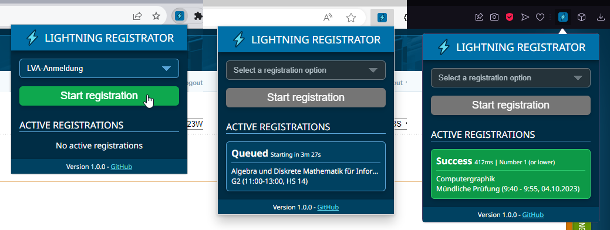

# TISS Lightning Registrator

TISS Lightning Registrator is a browser extension that automatically registers you for an LVA, group or exam in TISS as soon as it opens. Start the extension a few minutes in advance, and once the registration begins, the extension will execute the registration process as fast as possible.

Registrations are done in the background, it doesn't load the whole page for better performance. Additionally you can switch tabs and continue using your browser while you wait for the registration to start.

As registrations don't open regularly, to try the extension out, it can also be used to register for an LVA, group or exam which has already opened.

## Installing

The extension is available for Chrome and other Chromium browsers (Opera, Edge, etc). A Firefox version will be added in the future. The extension is not available on the Chrome Web Store, it has to be installed manually with the following steps:

1. Download the zip of the latest release from the GitHub [releases](https://github.com/The-breakbar/TISS-Lightning-Registrator/releases) and unpack it.
2. Navigate to the browser page of your installed extensions. It can be found under "Manage extensions" in your browser options or by going to the following links depending on your browser:

   - Chrome: `chrome://extensions`
   - Opera: `opera://extensions`
   - Edge: `edge://extensions`

3. Enable "Developer mode" in the top right (left side for Edge).
4. Click the "Load unpacked extension" button and select the unpacked folder which you downloaded (make sure you select the folder which contains all the files).
5. Done! Pin the extension to your top bar and use it by clicking on its icon.

To update the extension, simply remove the existing version and install the newest version with the same steps.

## How it works

> If you are interested, see [DEVELOPMENT.md](DEVELOPMENT.md) for a more detailed explanation of the extension's development and the TISS API.

The extension essentially does the same steps a regular user would do, however it can register as soon as it receives a response from the server, instead of having to wait for the rest of the page to load. This allows it to perform the registration process much quicker and register faster than a human user would be able to.

As the extension is based very tightly on the TISS website, any future changes to the site may break the extension.

## Bug reports

All bug reports are appreciated! If you find any bugs, feel free to open an [issue](https://github.com/The-breakbar/TISS-Lightning-Registrator/issues). Error messages can be found in the console of the tab where the extension was used (they're only present as long as you don't refresh or change the page). There might also be an "Errors" button on the browser settings page where the extension was installed. It contains errors from the pop-up window, as those are not logged to the regular console.
